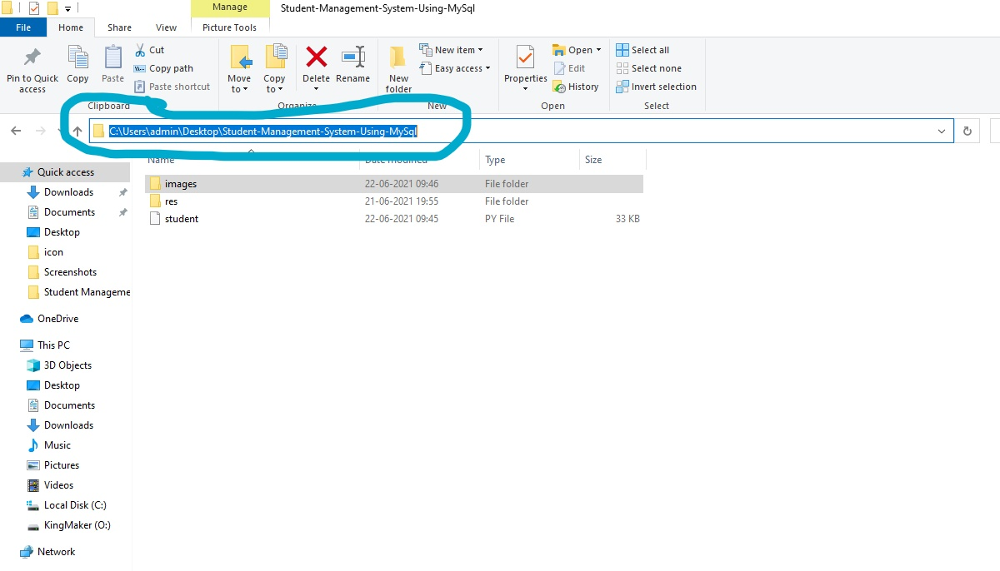
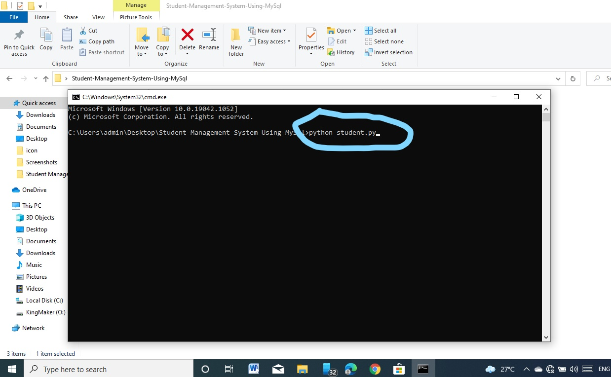
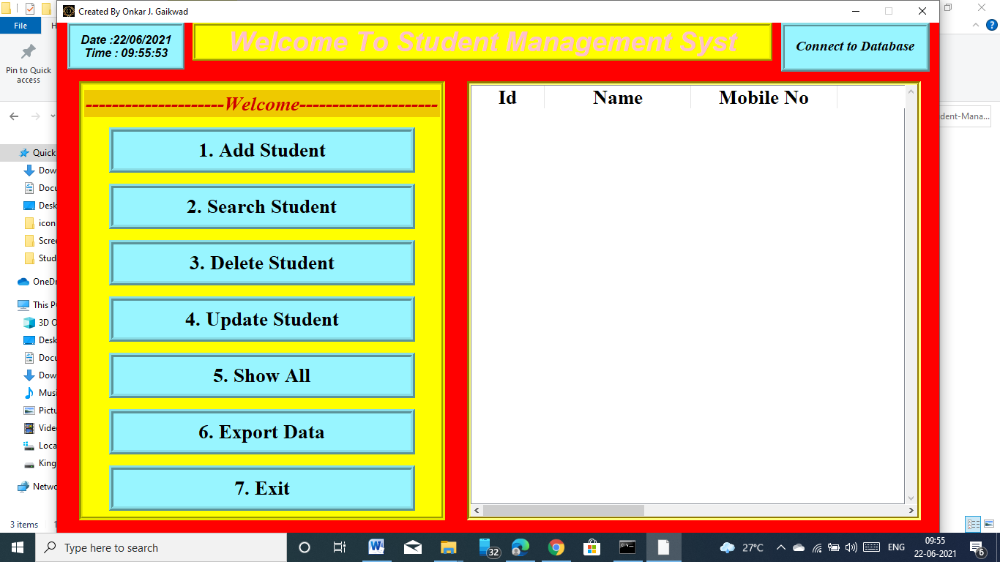
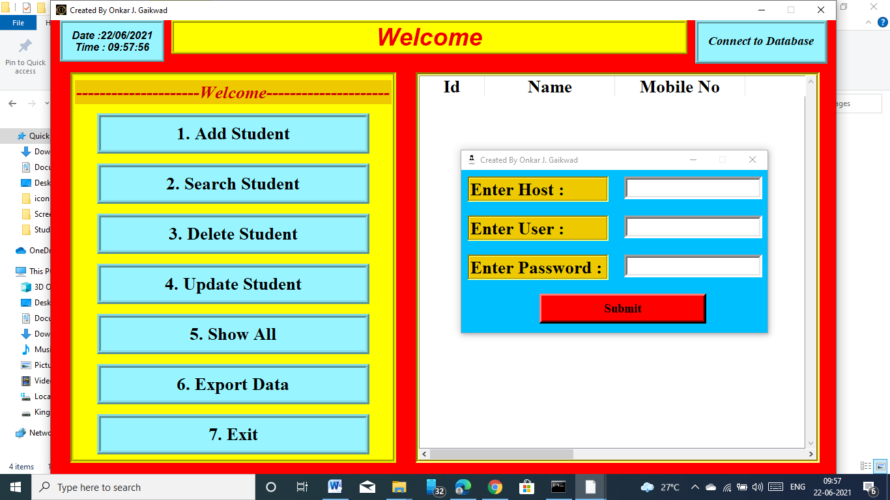
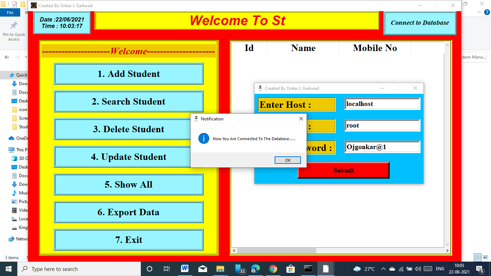

# **Student Management System Using Python and Mysql**

## **About**

This Student Management System is scripted using python and connected to database using MySql.

This project is basically a Student Management System and it can be used for storing, updating, deleting, reading the student&#39;s information or records and additionally you can also Export student&#39;s records.

## **Features:**

1. Add Students
2. List All Students
3. Search Students
4. Remove Students
5. Update Students
6. Export Students Records

## **How to install and run this Project in your System?**

### **What You Need to Install?**

1. Install Python According to your Operating System
    1. [Click here to go Python Website for Downloading Python](https://www.python.org/downloads/)

2. Install MySql with respect to your Operating System
    1. [Click here to go MySql Website for Downloading Mysql](https://dev.mysql.com/downloads/windows/installer/8.0.html)

### **Which Python Libraries are required and how to get that?**

1. Open Command Prompt or Windows PowerShell.If you are getting problem to find cmd (Command Prompt) then press windows button + R then search cmd and enter

2. Then type following commands and run it (means after typing any command press Enter) and you can see the libraries are started to downloading if it is already present then it show already satisfied and successfully installed.

  1. pip install pymysql
  2. pip install tkinter
  3. pip install pandas

3. Download Zip File from github.

### **How to Run this Project in your System?**

1. Open the downloaded zip file.

2. Extract the zip file where you want.

3. If you already know how to run the python file in cmd or in other IDE then avoid these steps.

4. Follow the following images to run your project and instructions. First you need to open file path or where you saved the file after extracting.

5. Double Click on the path or manually select.

6. After selecting clear and type cmd and press Enter

7. Then cmd will be open then type python student.py and press Enter

8. Then you see a new Window will open.

9. Click on Connect to Database.

10. Enter the Details and Click on Submit.

Note: The password will be different to you. Enter the password that you entered in the process of installation of MySql. This Step is very important because it will create database and table in that database where our data will be stored.

11. If you are connected to database at 1st time then it show, Database is Created And Now Your Connected To The Database......

Otherwise it show Now You Are Connected To Database…..

12. Here we go all steps are over now you can add, delete, update the student information and most important you can export your Student Data or Information or Records using Export button.

Note: As say earlier the step of connecting (step10) to your database is important. When you run this project you 1st need to connect to your Database then after successful connection you can perform your operations like Add, Update, Delete, Search. For viewing you students Data just click on Show All Button. For Exporting your Students Data just click on Export Button and then select path and name for your csv file if not selected path and name then it will be stored in default folder where your project is present and named as .csv file.
